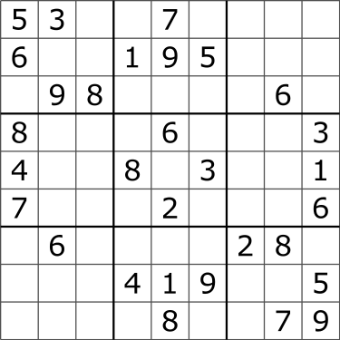

# sudoku-solver-cpp
A simple command-line based sudoku solver made in C++.  
`.exe` file can be found in `\\build\\bin`. 

# How to use

To input a sudoku board, input the board as a line of rows.  
The periods(.) represent empty cells, while the dashes(-) split the rows.  

**Example:**  
53..7....-6..195...-.98....6.-8...6...3-4..8.3..1-7...2...6-.6....28.-...419..5-....8..79

**Image format:**  

